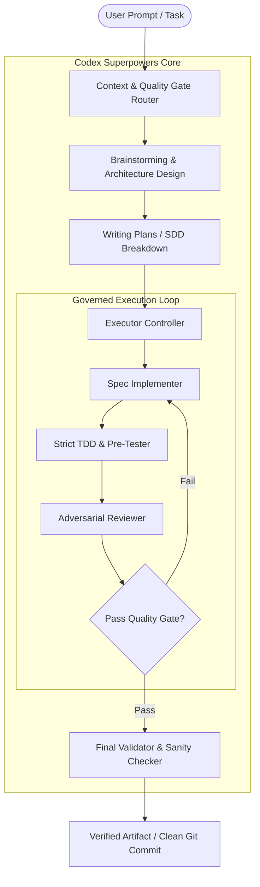

# Codex-superpower

<div align="center">

[](https://github.com/fernandoxavier02/Codex-superpower)
[](LICENSE)
[](codex-global/)
[](https://github.com/fernandoxavier02)

**Agentic superpowers and deterministic multi-agent governance framework adapted for OpenAI Codex CLI.**

[Features](#-key-features) • [Architecture](#-architecture--lifecycle) • [Skills Catalog](#-skills-catalog) • [Codex Subagents](#-specialized-codex-subagents) • [Installation](#-installation--quickstart) • [Attribution](#-attribution--authorship)

---

</div>

## 🌟 Overview

**Codex-superpower** provides a deterministic, multi-agent engineering workflow directly integrated into the OpenAI Codex CLI runtime. It equips Codex with structured reasoning skills, adversarial code review gates, visual brainstorming, subagent-driven development (SDD), and strict test-driven development (TDD) protocols.

Originally conceived for agentic workflows and adapted for Codex by **Fernando Xavier (FX Studio AI)**, this framework transforms standard CLI sessions into a governed software engineering studio.

---

## 🚀 Key Features

- **⚡ 26 Specialized Codex Subagents:** Purpose-built agent roles ranging from architecture validators to adversarial reviewers and frontend specialists.
- **🛡️ Deterministic Quality Gates:** Pre-commit hooks and state machine enforcement preventing untested regressions and plan drift.
- **🧠 Visual Brainstorming & Spec System:** Interactive design exploration and living architecture documentation.
- **🔄 Subagent-Driven Development (SDD):** Autonomous task decomposition with implementer/reviewer pair-programming loops.
- **🧪 Strict TDD & Debugging Workflows:** Enforced red-green-refactor cycles and root-cause tracing.

---

## 🏗️ Architecture & Lifecycle



---

## 🧰 Skills Catalog

| Skill | Trigger / Command | Description |
| :--- | :--- | :--- |
| **`brainstorming`** | `/brainstorm` | Visual & conversational architecture exploration before code mutation. |
| **`writing-plans`** | `/write-plan` | Step-by-step implementation plan generation with test boundaries. |
| **`executing-plans`** | `/execute-plan` | Controlled execution of pre-approved task specs. |
| **`subagent-driven-development`** | `sdd` | Parallel subagent dispatch with isolated reviewer/implementer roles. |
| **`test-driven-development`** | `tdd` | Strict red-green-refactor workflow enforcement. |
| **`systematic-debugging`** | `debug` | Root-cause tracing with condition-based waiting and polluter isolation. |
| **`using-git-worktrees`** | `worktree` | Isolated parallel branch workspaces for zero contamination. |
| **`requesting-code-review`** | `review` | Adversarial code review against project standards and contracts. |

---

## 🤖 Specialized Codex Subagents

The framework provisions **26 specialized agent roles** in `codex-global/agents/`:

```
codex-global/agents/
├── adversarial-reviewer.md         # Adversarial code and security review
├── architecture-reviewer.md        # Architectural pattern and coupling analysis
├── auditor-senior.md               # Compliance, audit trail, and governance check
├── context-classifier.md           # Task routing and workflow categorization
├── executor-controller.md          # Multi-step task dispatch and tracking
├── executor-implementer.md         # Core code implementation engine
├── final-adversarial-orchestrator.md # Final gate before delivery
├── quality-gate-router.md          # Dynamic quality gate evaluation
├── redteam.md                      # Adversarial boundary testing
├── spec-implementer.md             # Spec-to-code compiler
└── ... (and 16 more domain specialists)
```

---

## 📦 Installation & Quickstart

### Prerequisites
- Node.js >= 18.0.0
- OpenAI Codex CLI installed and configured
- Git

### Quick Setup

1. **Clone the repository:**
   ```bash
   git clone https://github.com/fernandoxavier02/Codex-superpower.git
   cd Codex-superpower
   ```

2. **Register skills in Codex environment:**
   ```bash
   npm install
   # Or link hooks into your Codex configuration
   npm run setup
   ```

3. **Verify installation:**
   ```bash
   node scripts/mcp/superpowers-codex-diagnostics.mjs
   ```

---

## 📄 Attribution & Authorship

- **Author & Codex Adaptation:** [Fernando Xavier](https://github.com/fernandoxavier02) — *Founder, FX Studio AI*
- **Framework Origin:** Adapted for the OpenAI Codex CLI ecosystem from multi-agent superpowers patterns.
- **Repository:** [https://github.com/fernandoxavier02/Codex-superpower](https://github.com/fernandoxavier02/Codex-superpower)
- **License:** [MIT License](LICENSE)
